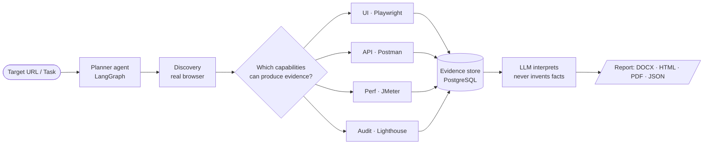

 

---

## ⚡ Who I am

I'm an **AI engineer from Multan, Pakistan** who takes an AI feature from *idea → working backend → usable UI → deployed cloud infrastructure*.

I started by automating workflows for freelance clients with n8n and OpenAI. That pulled me into building AI properly: multi-tenant, **agentic and multimodal RAG** systems, agent workflows with LangGraph, and an AI testing platform that runs real browsers and load generators instead of guessing. I also understand the cloud under it all (**Microsoft Azure AZ-104 certified**).

I'm finishing my **BS in Computer Science (NUML, Multan, 2026)** and preparing for a **Master's in AI**, with research on making LLM agents *reliable and secure*.

> 🎯 **Currently:** AI Engineering Intern at **Cyberify** (LangChain + LangGraph agent workflows, FastAPI / Node.js backends, React frontends) · building an agent prompt-injection benchmark · applying for Master's programs in AI.

---

## 🧭 Experience

| Role | Where | What I did |
|---|---|---|
| **AI Engineering Intern** | **Cyberify** · Onsite · Aug 2026 – Sep 2026 | Built RAG and agent workflows with **LangChain** and **LangGraph** for enterprise use cases. Wrote backend APIs in **FastAPI** and **Node.js/Express** and connected them to **React** frontends. |
| **AI Automation Specialist** | **Upwork** · Freelance | Designed and deployed **n8n** automation workflows for **5+ clients** across lead management, CRM syncing and email automation. Integrated OpenAI, Google Sheets and webhook APIs, cutting client manual workload by an **estimated 60%**. Built RAG support-chatbot pipelines on OpenAI APIs. |
| **Team Lead** | **Final-year project** · NUML | Led the team that built an **Agentic ERP for SMEs**: inventory, HR and finance modules, LLM orchestration, multi-role access control, real-time database sync. |

---

## 🚀 Featured projects

### 🧪 [AI Agentic QA Testing Platform](https://github.com/sarmadnawaz1/Agentic-QA)
> *Give it a URL. It discovers the app, decides what can be tested, drives real engines, and writes the report.*

An agent plans and runs a full QA assessment of a web app across **UI, API, security, performance, responsiveness, regression and deprecation checks**. It drives a real browser, a real Postman desktop app, a real load generator and a real auditing tool.

**Design rule I built everything around:**

> **The engines establish facts. The model interprets them.**
> No status code, timing or pass/fail outcome comes from a language model. If an engine didn't run, the report says *blocked*, never *passed*.

`Python` `FastAPI` `LangGraph` `Playwright` `Lighthouse` `JMeter` `PostgreSQL` `SQLAlchemy` `React` `Vite` `Docker` · Streams live progress and generates consolidated **DOCX / HTML / PDF / JSON** reports.

---

### 🌐 [Embeddable Multi-Tenant Website-to-RAG Chatbot](https://github.com/sarmadnawaz1/embeddable_RAG)
> *Paste a public URL. Get a branded chatbot with its own isolated knowledge base.*

A **solo build, from crawler to embeddable widget.** Playwright crawls asynchronously through Celery, content and brand are extracted, documents are chunked and embedded with Gemini into **pgvector**, and every vector query is filtered by `project_id`, so one tenant can never retrieve another tenant's data. Ships as an embeddable chat widget with per-project branding.

`React` `Vite` `Tailwind` `FastAPI` `Celery` `Redis` `PostgreSQL + pgvector` `LangChain` `LangGraph` `Playwright` `Gemini` `Docker`

---

### 📨 T Rex: AI Sales Outreach & Automation Platform *(team project)*
A lead-outreach platform covering lead management, outbound campaigns, knowledge retrieval and AI-assisted engagement. I worked across the architecture and **owned the SMS engine**:

- 📱 **SMS Engine:** two-way conversational SMS on **Twilio**, Celery queue processing, inbound/outbound webhook handling and a React UI for managing conversations.
- ✉️ **Mailer Engine:** Celery-queued campaigns sent through Resend, AI-written messages with Groq, inbound reply handling and status tracking.
- 🕷️ **Scraper & Client Knowledge Base:** crawler that pulls lead website data, embeds it and stores it in pgvector so outreach messages use real context.

`FastAPI` `Celery` `Redis` `PostgreSQL` `pgvector` `React` `Docker` `HubSpot` `Twilio` `Groq` `Resend`

---

### 📬 [AI-Powered Email Campaign Automation Platform](https://github.com/sarmadnawaz1/Email-Campaign-Agent)
Generates personalized **multi-step email campaigns** from company knowledge, contact data, campaign goals and earlier messages. Handles automated follow-ups, approval workflows, scheduled sending, unsubscribes, delivery tracking and **HubSpot CRM** integration.

`React` `FastAPI` `PostgreSQL` `pgvector` `Celery` `Redis` `LangGraph` `Gemini` `HubSpot API`

---

### 🛠️ [Free AI & Utility Tools Platform](https://github.com/sarmadnawaz1/Free_Tool)
A no-login browser suite: **background removal, AI image restoration and upscaling, PDF merge/split/compress, audio conversion, music stem splitting, media downloading.** Open-source models (**U²-Net, Swin2SR, Demucs via ONNX Runtime**) run in-process, lazy-loaded from Hugging Face and cached in memory so repeat requests are fast.

`React` `TypeScript` `FastAPI` `PyTorch` `ONNX Runtime` `Hugging Face` `FFmpeg` `PyMuPDF`

---

### 🏢 Agentic ERP System for SMEs *(final-year project, team lead)*
Full-stack ERP with inventory, HR and finance modules, LLM orchestration, role-based access control and real-time DB sync. Led planning, task splitting and delivery.

`Node.js` `MySQL`

---

## 🧠 How I solve problems

I don't treat "it works on my machine" as done. These are real decisions from my own projects:

<b>1 · Keep the model out of the facts</b>

 

In the QA platform, an LLM *can* hallucinate a pass. So I removed that option: engines produce evidence (status codes, timings, counts), the model only interprets it, and a capability that didn't run is marked `blocked`, never `passed`. **Trust comes from the architecture, not from prompting harder.**

<b>2 · Make isolation structural, not hopeful</b>

 

In the multi-tenant RAG system, cross-tenant leakage is the failure that matters most. Every vector search is filtered by `project_id` at the query layer, and the isolation behavior is covered by tests that run against real Postgres + pgvector.

<b>3 · Start from an empty repo and ship the whole slice</b>

 

I took T Rex's SMS engine from nothing to a working feature: Twilio APIs, Celery workers, webhooks and the React UI. I'm comfortable owning a feature across every layer instead of waiting for a handoff.

<b>4 · Design for the slow, flaky, and heavy parts</b>

 

Crawling, embedding, sending email and running load tests don't belong in a request cycle. I push them to **Celery + Redis** workers, stream progress back to the UI, and lazy-load and cache heavy models so latency is paid once.

<b>5 · Turn messy human processes into systems</b>

 

Working directly with 5+ freelance clients taught me to start from how people actually work, then automate *that*. The result was an estimated 60% cut in manual workload, and automations the clients kept using.

---

## 🔬 Research & exposure

My research direction: **how do we make LLM agents trustworthy enough to be given real responsibility?**

| Area | Where I am |
|---|---|
| 🛡️ **Prompt injection & agent robustness** | **In progress:** a benchmark study asking *"can a web page trick an LLM testing agent into a wrong verdict?"* It builds injected pages and compares defenses. |
| 🤖 **Agentic AI & LLM agents for software testing** | Hands-on through the Agentic QA platform: planning, tool use, evidence handling and failure modes of multi-capability agents. |
| 🧩 **Small language models + LoRA fine-tuning** | Active interest and study area, going deeper as part of Master's preparation. |
| 🗄️ **Retrieval & RAG systems** | Built and shipped multi-tenant RAG with pgvector, Gemini and OpenAI embeddings, and query rewriting. |
| 🕸️ **Agentic RAG** | Built agentic RAG systems, where an agent decides *when and what to retrieve*, rewrites queries, and reasons over the results instead of running one fixed retrieve-then-answer pass. |
| 🖼️ **Multimodal RAG** | Built multimodal RAG systems that retrieve and answer across more than plain text, going beyond text-only pipelines. |

**Exposure across the stack:** agentic and multimodal RAG · LLM APIs (OpenAI, Gemini, Groq) · open models via Hugging Face / ONNX / PyTorch · agent orchestration (LangChain, LangGraph) · queues and async workers · CRM and messaging integrations (HubSpot, Twilio, Resend) · cloud administration on Azure.

📌 *Target:* **Master's in AI**, focused on agent reliability, security and evaluation.

---

## 🧰 Toolbox

| | |
|---|---|
| **🤖 AI / LLM** | `LangChain` `LangGraph` `RAG` `Agentic RAG` `Multimodal RAG` `AI Agents` `Embeddings` `pgvector` `OpenAI` `Gemini` `Groq` `Hugging Face` `ONNX Runtime` `PyTorch` |
| **⚙️ Backend** | `Python` `FastAPI` `Node.js` `Express` `Celery` `Redis` `SQLAlchemy` `REST` `Webhooks` `OAuth` |
| **🎨 Frontend** | `React` `TypeScript` `JavaScript` `Vite` `Tailwind CSS` `React Router` |
| **🗄️ Data** | `PostgreSQL` `pgvector` `MySQL` `MongoDB` |
| **🔌 Integrations & Testing** | `HubSpot` `Twilio` `Resend` `Playwright` `Lighthouse` `Apache JMeter` `n8n` |
| **☁️ Cloud & DevOps** | `Microsoft Azure (AZ-104)` `Azure CLI` `ARM` `Docker` `Git` `GitHub Actions` *(learning)* |
| **🌍 Also** | `C++` `Swift / SwiftUI` |

---

## 🏅 Certifications

- ☁️ **Microsoft Certified: Azure Administrator Associate (AZ-104)**
- 🐍 Python for Data Science, AI & Development: *Coursera / IBM*
- 📊 Python Project for Data Science: *Coursera / IBM*
- 🔀 Version Control: *Coursera*
- 📱 Advanced Programming in Swift · Create User Interfaces with SwiftUI: *Coursera*

---

## 📊 GitHub stats

---

## 🏗️ How my agent systems are shaped

---

## 🤝 Let's build something

I'm open to **AI engineering roles, internships, research collaborations, and Master's-level research opportunities** in agentic AI, LLM testing and AI security.

*"The engines establish facts. The model interprets them."*

